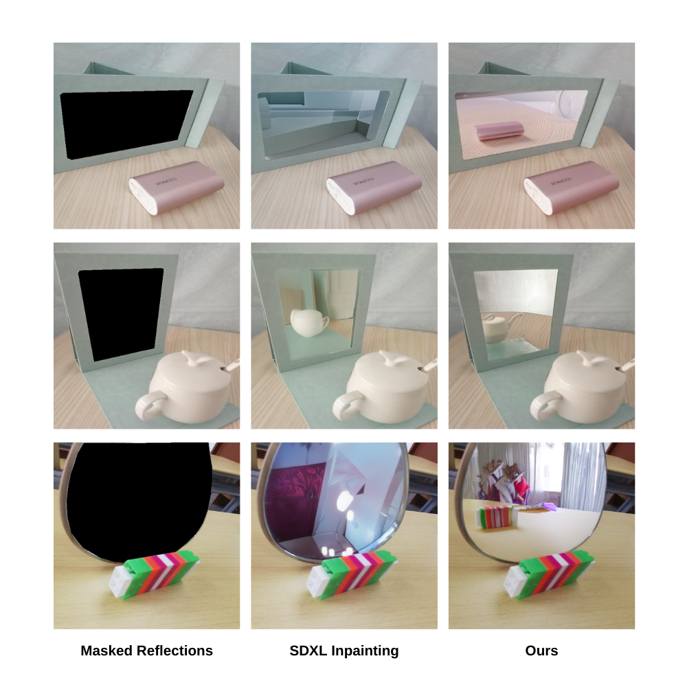

# inpainting_reflections



## Setup
```bash
pip install -r requirements.txt
pip install autoroot autorootcwd pandas wandb bitsandbytes python-dotenv
```
## Training
```bash
CUDA_VISIBLE_DEVICES=0 python train_sdxl.py \
--pretrained_model_name_or_path="diffusers/stable-diffusion-xl-1.0-inpainting-0.1" \
--train_data_dir="/mnt/51eb0667-f71d-4fe0-a83e-beaff24c04fb/om/data/MSD/train" \
--val_data_dir="/mnt/51eb0667-f71d-4fe0-a83e-beaff24c04fb/om/data/MSD/val" \
--output_dir="nn" \
--resolution=1024 \
--train_batch_size=8 \
--gradient_accumulation_steps=1 --gradient_checkpointing \
--use_8bit_adam \
--set_grads_to_none \
--unet_learning_rate=1e-5 \
--text_encoder_learning_rate=1e-5 \
--lr_scheduler="cosine_with_restarts" \
--lr_warmup_steps=100 \
--max_train_steps=5000 \
--lora_rank=12 \
--lora_dropout=0.3 \
--checkpointing_steps=1000 \
--lora_alpha=20 \
--mixed_precision fp16
```

## Inference
```bash
CUDA_VISIBLE_DEVICES=0 python sdxl_infer.py \
--pretrained_model_name_or_path="diffusers/stable-diffusion-xl-1.0-inpainting-0.1" \
--model_path="/mnt/51eb0667-f71d-4fe0-a83e-beaff24c04fb/om/sdxl_inpainting/nn" \
--output_dir="output_sd" \
--lora_rank=12 \
--lora_dropout=0.3 \
--lora_alpha=20
```